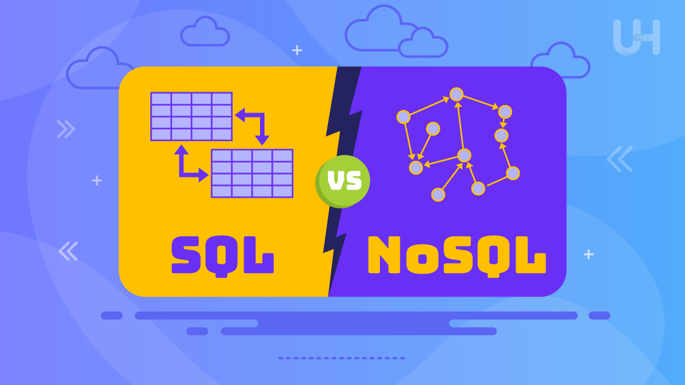

# Enterprise ICT Architectures - Dataset Project

This repository contains the project developed for the **Enterprise ICT Architectures** course. The project involves defining and querying datasets created by our team using various relational and non-relational database technologies.

## Project Structure
The project is divided into three sub-projects, each dedicated to a specific technology:

1. **SQL** - Implementation of relational databases and SQL queries.
2. **Neo4J and BPMN** - Data modeling with Neo4J (graph databases) and using BPMN notation for a given business process.
3. **MongoDB** - Use of NoSQL databases for managing and querying semi-structured data.

Each sub-project contains its own **README.md** with specific details on implementation, datasets, and queries used.

## Technologies Used
During the development of this project, we utilized:
- **SQL** for relational databases
- **Neo4J** for graph databases
- **MongoDB** for NoSQL databases
- **BPMN** for process modeling
- **Python** and **ChatGPT** for assisted data generation, ensuring compliance with assigned constraints

## Project Setup
To run the various sub-projects, follow the instructions provided in their respective README.md files.

## Contributors
This project was developed by the following team:
- Bamhaoud Younes
- Calcara Antonio
- Foini Lorenzo (https://github.com/LorenzoFoini)
- Martinelli Francesco

## License
This project is for educational purposes only and follows the course requirements of the Enterprise ICT Architectures course. 
All rights are reserved by the author, and the code is provided exclusively for academic use.
